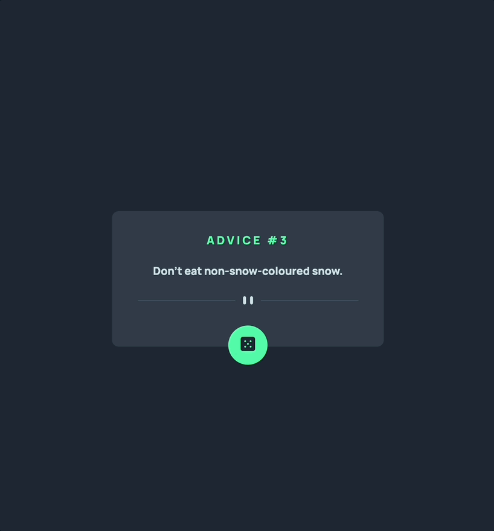

# Advice Generator App

Essa é uma solução para o [Desafio: "Advice Generator App" do Frontend Mentor](https://www.frontendmentor.io/challenges/advice-generator-app-QdUG-13db). Os desafios que esse site oferece ajuda desenvolvedores a melhorar suas habilidades de código!

## O Desafio

Usuários devem poder:

- Ver o layout ideal para o conteúdo dependendo do tamanho da tela do dispositivo

- Ver os estados hover para todos os elementos interativos da página

- Gerar um conselho aleatório ao clicar no botão

## Tecnologias Utilizadas

- HTML

- CSS

- JavaScript

- API
  - [adviceslip](https://api.adviceslip.com/)

## Aprendizado

- Treinei o uso de APIs externas

- Apliquei os conceitos de código assíncrono e de tratamento de erros
  - Usando `async` e `await`
  - Usando o `try` e `catch`

- Reforcei o entendimento da diferença entre innerHTML, innerText e textContent

## Preview

